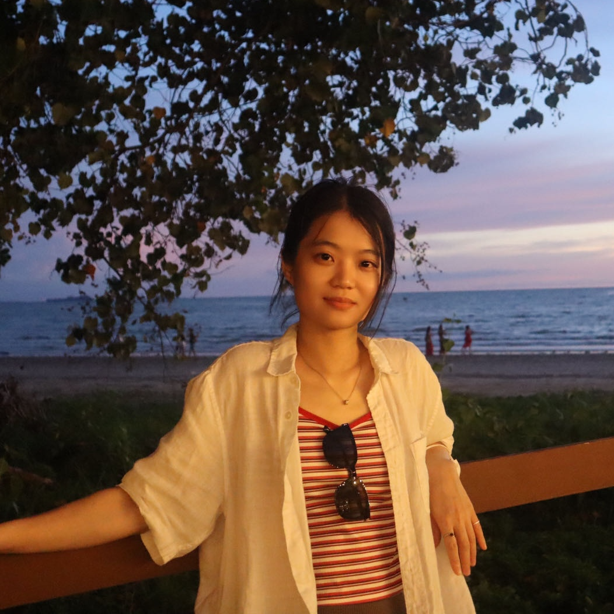
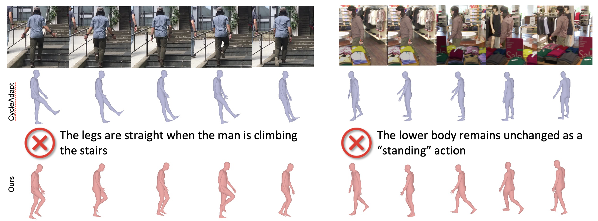
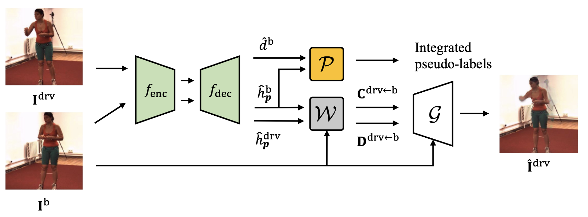
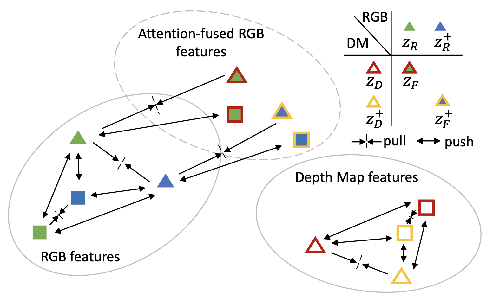
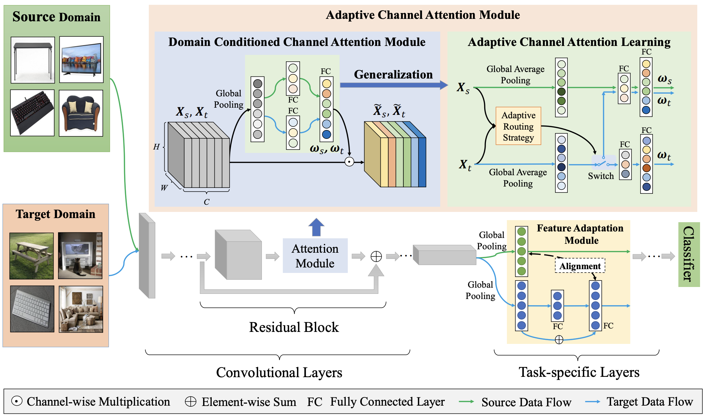
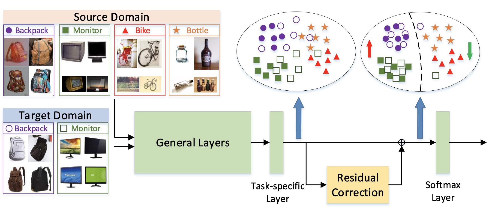
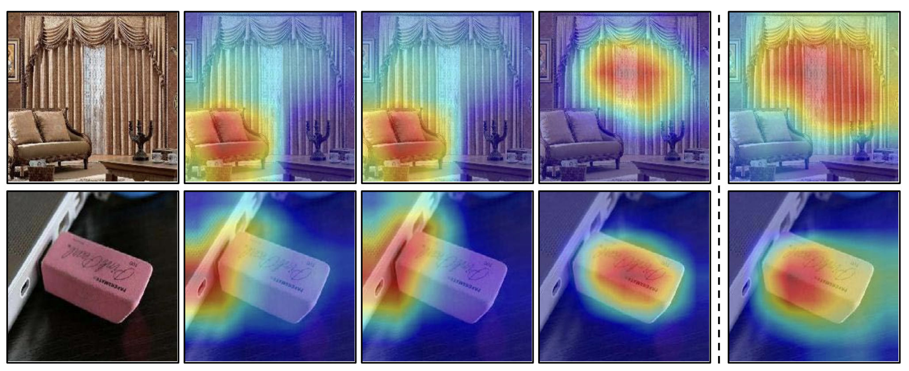

  

    <h1>Qiuxia Lin</h1>
    
Computer Vision & Machine Learning Lab

    
School of Computing, National University of Singapore

    
117416, Singapore

  

<!-- **Qiuxia Lin**

<!-- Computer Vision & Machine Learning Lab

School of Computing, National University of Singapore

117416, Singapore

Email: qiuxia@comp.nus.edu.sg --> 

---

📅 08/2020-Present: PhD of Computer Science, National University of Singapore, advised by [Prof. Angela Yao](https://www.comp.nus.edu.sg/~ayao/)

🎓 Received Bachelor & Master degrees at Beijing Institute of Technology, advised by [Prof. Chi (Harold) Liu](https://pure.bit.edu.cn/en/persons/chi-liu) & [Prof. Shuang Li](https://shuangli.xyz/)

[GitHub](https://github.com/linqiuxia-lynn) | [Google Scholar](https://scholar.google.com/citations?user=fUCbVmcAAAAJ&hl=en) | [DBLP](https://dblp.org/pid/243/1756.html) |

---

### About Me👩🏻‍💻

Hi! I am currently a PhD student of Computer Science at National University of Singapore (NUS) with Prof. Angela as my advisor. My current research centers on visual perception and multimodal understanding with large foundation and advanced models. I have previously worked on semi-/self-supervised learning and domain adaptation for 2D/3D pose estimation, with a focus on enabling robust interaction understanding across diverse environments. I am exploring potential research collaborations or industry positions. Don't hesitate to get in touch!

---

### Research Interests💡

* Multimodal Understanding
* 2D/3D Pose Estimation
* Domain Adaptation
  

---

### Publications📔

  

Semantics-aware Test-time Adaptation for 3D Human Pose Estimation 
<u>Qiuxia Lin</u>, Rongyu Chen, Kerui Gu, Angela Yao 
The International Conference on Machine Learning (ICML), 2025 
<a href="https://arxiv.org/pdf/2502.10724" target="_blank">PDF</a> 

  

Synthetic-to-Real Pose Estimation with Geometric Reconstruction 
<u>Qiuxia Lin</u>, Kerui Gu, Linlin Yang, Angela Yao 
The Conference on Neural Information Processing Systems (NeurIPS), 2023 
<a href="https://proceedings.neurips.cc/paper_files/paper/2023/file/a8223b0ad64007423ffb308b0dd92298-Paper-Conference.pdf" target="_blank">PDF</a>  

  

Cross-Domain 3D Hand Pose Estimation with Dual Modalities 
<u>Qiuxia Lin</u>, Linlin Yang, Angela Yao 
The IEEE / CVF Computer Vision and Pattern Recognition Conference (CVPR), 2023 
<a href="https://openaccess.thecvf.com/content/CVPR2023/papers/Lin_Cross-Domain_3D_Hand_Pose_Estimation_With_Dual_Modalities_CVPR_2023_paper.pdf" target="_blank">PDF</a>  

  

Generalized Domain Conditioned Adaptation Network 
Shuang Li, Binhui Xie, <u>Qiuxia Lin</u>, Chi (Harold) Liu, Gao Huang, Guoren Wang 
IEEE Transactions on Pattern Analysis and Machine Intelligence (TPAMI), 2021 
<a href="https://arxiv.org/pdf/2103.12339" target="_blank">PDF</a>  

  

Deep Residual Correction Network for Partial Domain Adaptation 
Shuang Li, Chi (Harold) Liu, <u>Qiuxia Lin</u>, Qi Wen, Limin Su,
Gao Huang, Zhengming Ding 
IEEE Transactions on Pattern Analysis and Machine Intelligence (TPAMI), 2020 
<a href="https://arxiv.org/pdf/2004.04914" target="_blank">PDF</a>  

  

Domain Conditioned Adaptation Network 
Shuang Li, Chi (Harold) Liu, <u>Qiuxia Lin</u>, Binhui Xie, Zhengming Ding, Gao Huang, Jian Tang 
The Proceedings of the AAAI Conference on Artificial Intelligence (AAAI), 2019 
<a href="https://arxiv.org/pdf/2005.06717" target="_blank">PDF</a>  

