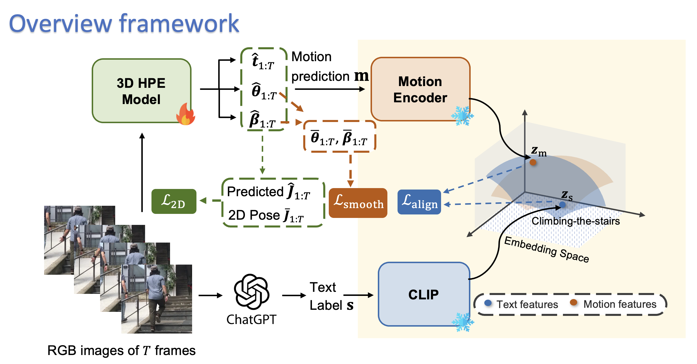
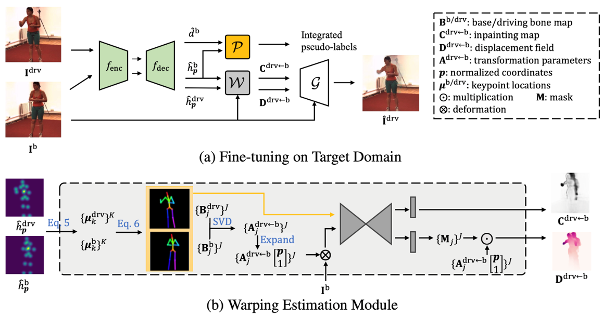

  

**Qiuxia Lin**

Computer Vision & Machine Learning Lab

School of Computing, National University of Singapore

117416, Singapore

Email: qiuxia@comp.nus.edu.sg

---

📅 08/2020-Present: PhD of Computer Science, National University of Singapore, advised by by [Prof. Angela Yao](https://www.comp.nus.edu.sg/~ayao/)

🎓 Received Bachelor & Master degree in Beijing Institute of Technology, advised by [Prof. Chi (Harold) Liu](https://pure.bit.edu.cn/en/persons/chi-liu) & [Prof. Shuang Li](https://shuangli.xyz/)

[GitHub](https://github.com/linqiuxia-lynn) | [Google Scholar](https://scholar.google.com/citations?user=fUCbVmcAAAAJ&hl=en) | [DBLP](https://dblp.org/pid/243/1756.html) |

---

### About Me👩🏻‍💻

Hi! I am currently a PhD student of Computer Science at National University of Singapore (NUS) with Prof. Angela as my advisor. My research interest lies in **2D/3D Pose Estimation** and **Domain Adaptation**. Particularly, I am recently focusing on using foundation and advanced models for domain adaptive pose estimation. I am exploring potential research collaborations or industry positions. Don't hesitate to get in touch!

---

### Research Interests💡

* 2D/3D Pose Estimation
* Hand/Human Shape Recovery
* Domain Adaptation
  

---

### Publications📔

  

**Semantics-aware Test-time Adaptation for 3D Human Pose Estimation**

<u>Qiuxia Lin</u>, Rongyu Chen, Kerui Gu, Angela Yao

*The International Conference on Machine Learning (ICML), 2025*

[PDF](https://arxiv.org/pdf/2502.10724) 

  

**Synthetic-to-Real Pose Estimation with Geometric Reconstruction**

<u>Qiuxia Lin</u>, Kerui Gu, Linlin Yang, Angela Yao

*The Conference on Neural Information Processing Systems (NeurIPS), 2023*

[PDF](https://proceedings.neurips.cc/paper_files/paper/2023/file/a8223b0ad64007423ffb308b0dd92298-Paper-Conference.pdf) 

  

**Cross-Domain 3D Hand Pose Estimation with Dual Modalities**

<u>Qiuxia Lin</u>, Linlin Yang, Angela Yao

*The IEEE / CVF Computer Vision and Pattern Recognition Conference (CVPR), 2023*

[PDF](https://openaccess.thecvf.com/content/CVPR2023/papers/Lin_Cross-Domain_3D_Hand_Pose_Estimation_With_Dual_Modalities_CVPR_2023_paper.pdf)

  

**Generalized Domain Conditioned Adaptation Network**

Shuang Li, Binhui Xie, <u>Qiuxia Lin</u>, Chi (Harold) Liu, Gao Huang, Guoren Wang

*IEEE transactions on pattern analysis and machine intelligence (TPAMI), 2021*

[PDF](https://arxiv.org/pdf/2103.12339)

  

**Deep Residual Correction Network for Partial Domain Adaptation**

Shuang Li, Chi (Harold) Liu, <u>Qiuxia Lin</u>, Qi Wen, Limin Su,
Gao Huang, Zhengming Ding

*IEEE transactions on pattern analysis and machine intelligence (TPAMI), 2020*

[PDF](https://arxiv.org/pdf/2004.04914)

  

**Domain Conditioned Adaptation Network**

Shuang Li, Chi (Harold) Liu, <u>Qiuxia Lin</u>, Binhui Xie, Zhengming Ding, Gao Huang, Jian Tang

*The Proceedings of the AAAI conference on artificial intelligence (AAAI), 2019*

[PDF](https://arxiv.org/pdf/2005.06717)

